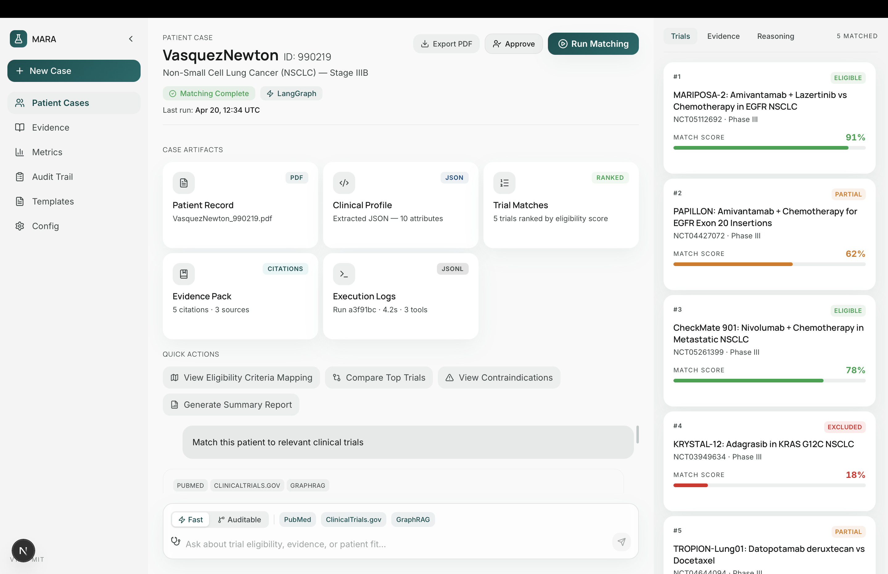

# Medical Research AI — Clinical Trial Matching UI

> **⚠️ All patient data, trial matches, citations, and metrics shown in this UI are entirely fictitious mock data. No real patient records, clinical trial results, or medical decisions are represented.**

A decision interface for clinicians built on top of the [MARA platform](https://github.com/ronit22203) (LangGraph + Temporal agents, PubMed / ClinicalTrials.gov / GraphRAG tools). Makes trial eligibility explainable in under 30 seconds.



*Screenshot: VasquezNewton (ID: 990219) — dummy patient, dummy trials, dummy scores. All data is seeded mock data for UI demonstration only.*

---

## Stack

| Layer | Technology |
|---|---|
| Framework | Next.js 16 App Router |
| Language | TypeScript (strict) |
| Styling | Tailwind CSS v4 |
| Fonts | Manrope (headlines) · Inter (body) |
| Components | Radix UI primitives |
| Data | **Static mock data** — no live backend required |

---

## What's in the UI

### 3-Column Case View (`/cases/[id]`)
- **Left sidebar** — Patient Cases · Evidence · Metrics · Audit Trail · Templates · Config
- **Main column** — Case header (status, runtime, actions) · Case artifacts · Quick actions · AI query panel
- **Right panel** — Ranked trials · Evidence citations · Reasoning trace

### AI Query Panel
- Glassmorphism floating input bar
- **Fast (LangGraph)** / **Auditable (Temporal)** mode toggle
- Tool chip toggles: PubMed · ClinicalTrials.gov · GraphRAG
- 4 suggested prompt pills
- Mock streaming response

### Trial Drill-Down
Click any trial card to open a split-screen modal:
- Left: inclusion / exclusion criteria with pass/fail indicators
- Right: patient attributes with highlighted matches
- Bottom: decision panel — **Eligible ✅** / **Partial ⚠️** / **Not Eligible ❌**

### Secondary Pages

| Route | Content |
|---|---|
| `/evidence` | Searchable citations browser (PubMed · ClinicalTrials · GraphRAG) |
| `/metrics` | Recall@5 · NDCG@5 · latency · cost/run with SVG sparklines |
| `/audit` | Clickable timeline → raw JSON per execution step |
| `/config` | Model selector · runtime toggle · temperature slider · tool on/off |
| `/templates` | Query template library with copy + run |

---

## ⚠️ Mock Data Notice

**All data in this repository is fabricated for UI development purposes:**

- `VasquezNewton (ID: 990219)` — fictional patient
- Trial matches (MARIPOSA-2, PAPILLON, CheckMate 901, KRYSTAL-12, TROPION-Lung01) — real trial names used for realism, but **match scores, eligibility decisions, and criteria mappings are invented**
- Citations and PubMed snippets — based on real papers but **relevance scores and snippets are synthetic**
- Metrics (Recall@5 85%, NDCG@5 79%) — from the MARA platform benchmark but **not tied to any live model run in this UI**
- Audit log entries — fabricated execution traces

To connect live data, replace `src/lib/mock/` with `fetch("/api/…")` calls. All TypeScript interfaces in `src/lib/types/` are designed to match the [clinical-graphrag-agents](https://github.com/ronit22203) execution log JSON shape exactly.

---

## Getting Started

```bash
npm install
npm run dev
```

Open [http://localhost:3000](http://localhost:3000) — redirects to `/cases/990219`.

---

## Backend

This UI is the frontend layer for the MARA platform:

| Repo | Role |
|---|---|
| `aws-data-acquisition` | Multi-cloud PDF fetcher (bioRxiv, medRxiv, PubMed, ClinicalTrials.gov) |
| `aws-prod-ingestion-graphrag` | OCR → Markdown → Chunk → Embed → Neo4j/Qdrant |
| `clinical-graphrag-agents` | LangGraph ReAct + Temporal workflows with YAML-configured tools |

---

## Author

**Ronit Saxena** · [ronitsaxena.in](https://www.ronitsaxena.in) · [github.com/ronit22203](https://github.com/ronit22203)

License: MIT
